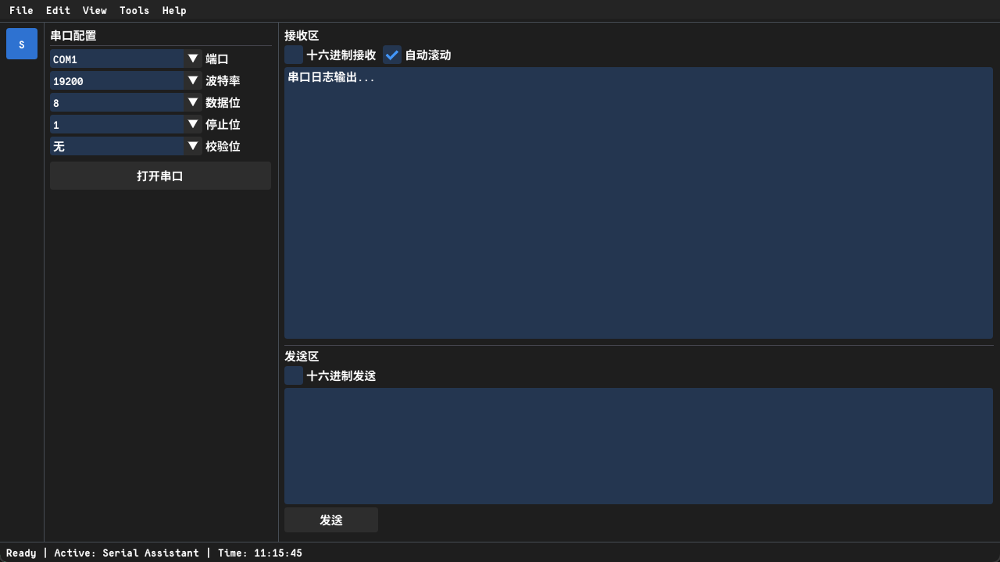

# OminiDrive-UI

<p align="center">
  
  <br>
  <b>OminiDrive-UI</b>
  <br>
  <i>一个轻量、高效、易于扩展的桌面应用框架</i>
</p>

- 💻 **编程语言**：C++
- 🎨 **渲染架构**：Dear ImGui 即时模式 GUI 与 OpenGL 渲染
- ⚡ **构建工具**：Bazel，支持一键编译到 Windows、Linux、MacOS 下的桌面应用程序
- 🧩 **易于扩展**：模块化页面（IPage）机制，易于添加各类工具页面

## 1. 安装指南

### 1.1 安装编译工具链

安装 Git

安装 Visual Studio 2022 或 **Build Tools for Visual Studio**

安装 Bazel

### 1.2 拉取仓库


### 1.3 根据所需页面拉取第三方源码

拉取 `ImGui` 和 `GLFW`：在仓库根目录执行：

```powershell
mkdir third_party -Force
git clone https://github.com/ocornut/imgui.git third_party/imgui
git -C third_party/imgui checkout docking
git clone https://github.com/glfw/glfw.git third_party/glfw
```

- ImGui 需使用 **docking** 分支

### 1.4 一键编译并运行
**一键编译**

在仓库根目录执行：

```powershell
bazel build //:app
```

成功后，可执行文件通常位于 `bazel-bin\app.exe`

**一键编译并运行**

```powershell
bazel run //:app
```

## 2. 使用指南

### 2.1 拉取已创建页面

### 2.2 创建自己的页面

## 仓库结构

| 路径 | 说明 |
|------|------|
| [`main.cpp`](main.cpp) | 入口：GLFW/OpenGL/ImGui 初始化、字体、主循环 |
| [`src/base/`](src/base/) | 壳与框架：`PageManager`、主题与布局 |
| [`src/template/`](src/template/) | 页面接口：`IPage` |
| [`src/ui/`](src/ui/) | 业务页面示例：串口助手、Inspire 气缸等 |
| [`third_party/`](third_party/) | ImGui、GLFW 源码及 Bazel 构建定义 |

新增页面：在 `src/ui` 实现 `IPage`，并在 `main.cpp` 里 `RegisterPage` 即可。
